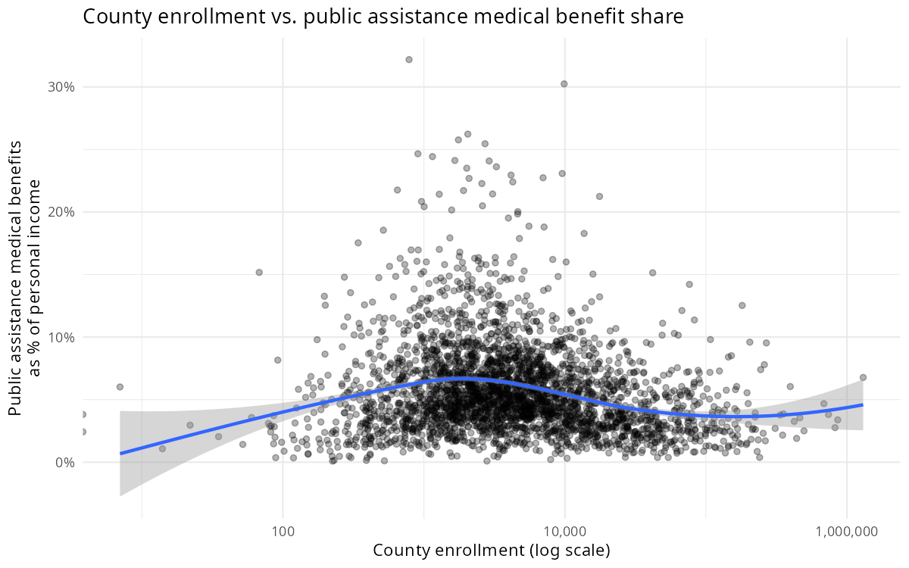
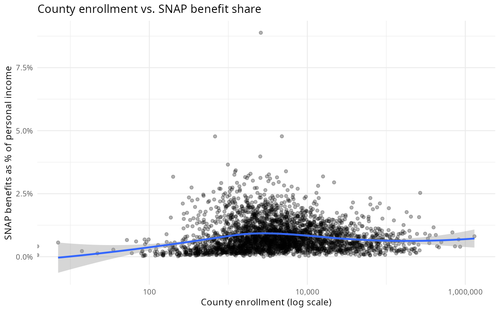
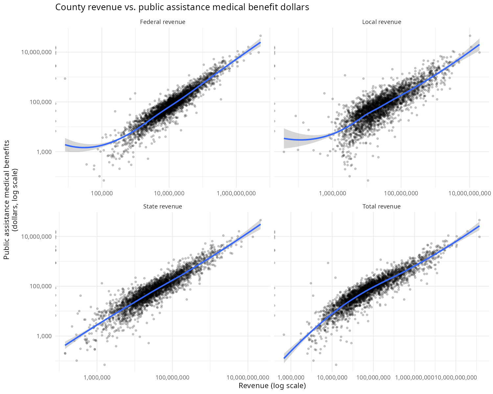
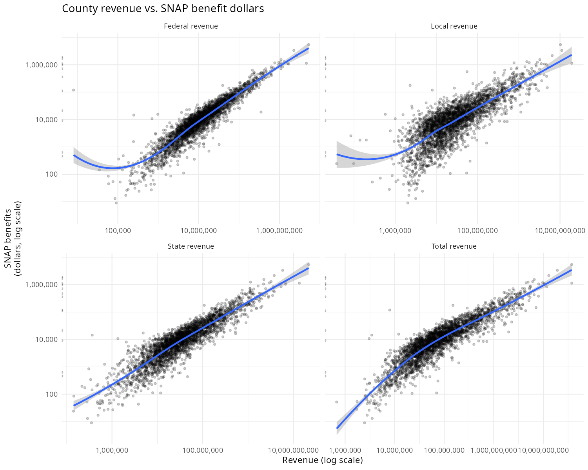

County-level relationships between school district finances and federal safety net program dollars. Data: NCES School District Finance Survey (2023), BEA Personal Income by County (2022).

## Enrollment

## Enrollment vs. Safety Net Benefits

## Revenue vs. Safety Net Benefits

