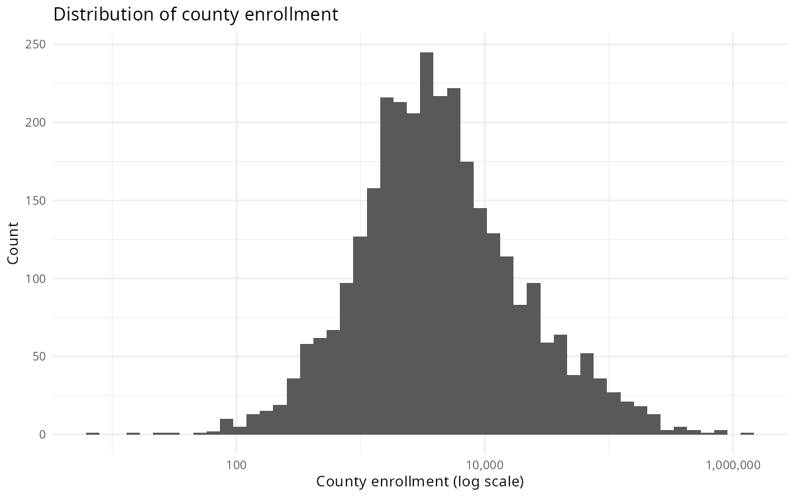
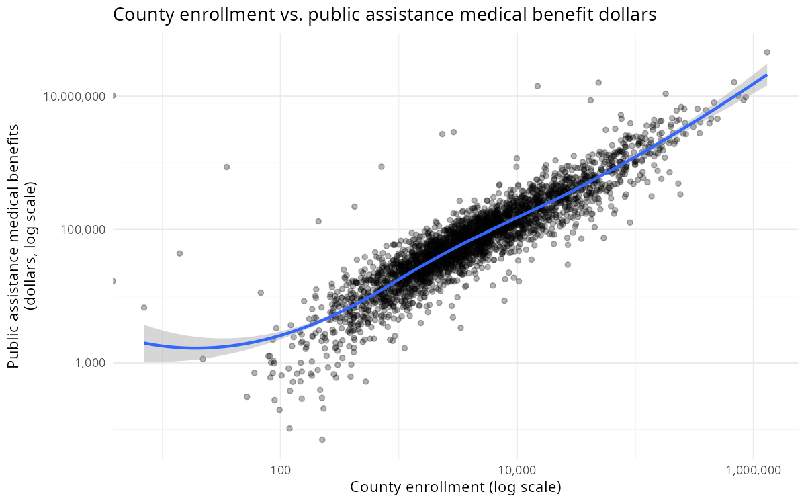
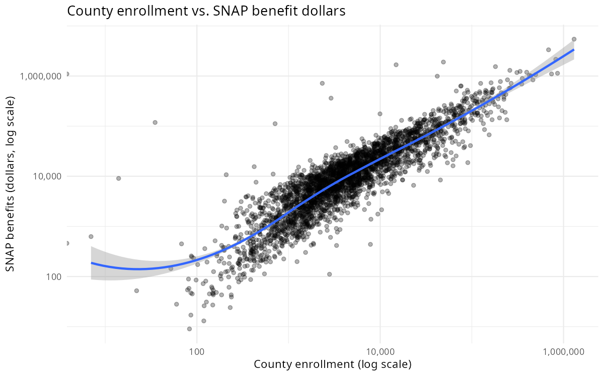

County-level relationships between student enrollment, share in poverty, and school funding gaps with federal safety net programs (dollars, and as a share of a county's tradable income). Data: NCES School District Finance Survey (2023), Manduca 2025, BEA Personal Income by County (2022), District Cost Database v6.0 (2023).

## Distributions

## Medicaid

::: {.panel-tabset}

### Dollars

### Share of Tradable Income

:::

## SNAP

::: {.panel-tabset}

### Dollars

### Share of Tradable Income

